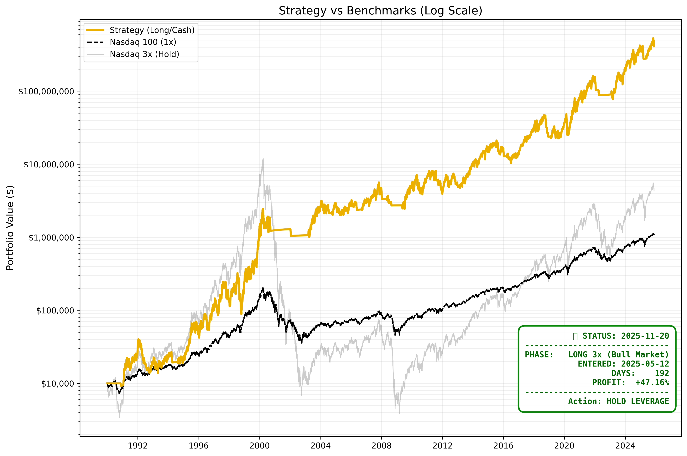

# 📊 Trading Strategy Optimizer


**Advanced multi-threaded backtesting framework for optimizing trading strategies across global indices and leveraged ETFs.**



## 🎯 Features

- **🌍 Multi-Market Support**: Interactive selection from Nasdaq 100, S&P 500, DAX 40, CSI 300, MSCI World
- **⚡ High-Performance Optimization**: Uses ProcessPoolExecutor to test thousands of parameter combinations (~60 tests/second on 12 cores)
- ** Risk-Adjusted Metrics**: Calculates Sharpe ratio, maximum drawdown, profit factor, and win rate
- **🎯 Multiple Strategies**: 
  - SMA + Buffer-based entry/exit
  - RSI confirmation filters
  - Dynamic stop-loss management
  - Cash yield during bear markets (T-Bill rate)
- **⏱️ Real-time Status**: Shows current market phase and recommended actions
- **📈 Comprehensive Reporting**: Generates detailed trade logs and performance metrics
- **🎨 Professional Visualizations**: Log-scale charts with benchmarks and strategy overlay
- **🚀 Vectorized Backtesting**: 100x faster using numpy array operations instead of loops

## 📈 Strategy Overview

The optimizer tests combinations of:
- **SMA Periods**: 180-230 day moving averages
- **Buffer Zones**: 1-3% bands around SMA for entry/exit
- **RSI Filters**: Momentum confirmation (50+ threshold)
- **Stop Losses**: 10-25% trailing stops

### How It Works

1. **Entry Signal**: Price crosses above SMA + buffer with RSI > threshold
2. **Exit Signal**: Price falls below SMA or hits stop loss
3. **Cash Position**: Earns risk-free rate (T-Bill yield) when out of market
4. **Cost Modeling**: Includes expense ratios and transaction fees

## 🚀 Quick Start

### Prerequisites

- Python 3.8 or higher
- pip package manager

### Installation

```bash
# Clone the repository
git clone <repository>
cd finance

# Create virtual environment (recommended)
python3 -m venv .venv
source .venv/bin/activate  # On Windows: .venv\Scripts\activate

# Install dependencies
pip install yfinance pandas numpy matplotlib
```

### Run Optimization

```bash
python main.py
```

**Interactive Market Selection:**
```
========================================
🌍 SELECT MARKET INDEX
========================================
 [1] Nasdaq 100
 [2] S&P 500
 [3] DAX 40
 [4] CSI 300
 [5] MSCI World
========================================
Enter number (default 1): 
```

The script will download historical data (~35 years) from Yahoo Finance on each run.

## 🤖 Automated Daily Analysis

The repository includes a GitHub Actions workflow that automatically generates fresh strategy charts every day at 6 AM UTC for all indices:

- **Nasdaq 100**: `examples/nasdaq100_latest.png`
- **S&P 500**: `examples/sp500_latest.png`
- **DAX 40**: `examples/dax40_latest.png`
- **CSI 300**: `examples/csi300_latest.png`
- **MSCI World**: `examples/msci_world_latest.png`

Historical snapshots are also saved with timestamps (retained for 90 days).

You can manually trigger the workflow from the Actions tab or wait for the daily scheduled run.

## 📊 Output

The script generates:

1. **Performance Chart**: `examples/latest.png`
   - Strategy equity curve
   - Nasdaq 100 (1x) benchmark
   - Nasdaq 3x benchmark
   - Current market phase indicator

2. **Trade History Table**: Console output showing all historical entries/exits

3. **Performance Metrics**:
   - Total return
   - Sharpe ratio
   - Maximum drawdown
   - Number of trades
   - Win rate
   - Current position status

## ⚙️ Configuration

### Available Markets

Edit `INDEX_MAP` in `main.py` to customize available indices:

```python
INDEX_MAP = {
    "1": {"Ticker": "^NDX", "Name": "Nasdaq 100", "Currency": "$"},
    "2": {"Ticker": "^GSPC", "Name": "S&P 500", "Currency": "$"},
    "3": {"Ticker": "^GDAXI", "Name": "DAX 40", "Currency": "€"},
    "4": {"Ticker": "000300.SS", "Name": "CSI 300", "Currency": "¥"},
    "5": {"Ticker": "URTH", "Name": "MSCI World", "Currency": "$"},
}
```

### Strategy Parameters

Edit optimization ranges in `main.py`:

```python
# Core Settings
START_DATE = "1990-01-01"    # Backtest start date
INITIAL_CAPITAL = 10000      # Starting capital

# Optimization Ranges
SMA_RANGES = range(180, 230, 10)              # SMA periods: 180, 190, 200, ..., 230
BUFFER_RANGES = [1.0, 2.0, 3.0]               # Buffer zones: 1%, 2%, 3%
RSI_RANGES = [50]                              # RSI threshold (disabled if 0)
STOP_LOSS_RANGES = np.arange(0.10, 0.25, 0.02)  # Stop loss: 10% to 25%

# Cost Modeling
EXPENSE_RATIO = 0.0095       # Annual expense ratio (0.95% for 3x ETF)
TRANSACTION_FEE = 0.001      # Per-trade fee (0.1%)
```

### Performance Tuning

Adjust parallelization based on your CPU:

```python
from multiprocessing import cpu_count
MAX_WORKERS = min(cpu_count(), 16)  # Use up to 16 cores
```

## 📁 File Structure

```
finance/
├── .github/
│   └── workflows/
│       └── daily-analysis.yml       # Automated daily chart generation
├── main.py                          # Main optimization script
├── README.md                        # Documentation
├── .gitignore                       # Git ignore rules
└── examples/                        # Generated charts (auto-created)
    ├── latest.png                   # Most recent manual run
    ├── nasdaq100_latest.png         # Daily auto-generated (CI)
    ├── sp500_latest.png             # Daily auto-generated (CI)
    ├── dax40_latest.png             # Daily auto-generated (CI)
    ├── csi300_latest.png            # Daily auto-generated (CI)
    ├── msci_world_latest.png        # Daily auto-generated (CI)
    └── *_YYYYMMDD.png               # Timestamped snapshots
```

## 🔧 Advanced Usage

### Custom Strategies

Modify the `optimize_worker()` function to implement your own strategy logic:

```python
def optimize_worker(args):
    sma_len, buffer_pct, rsi_min, sl_pct = args
    
    # Your custom indicator calculations here
    sma = calculate_sma(prices, sma_len)
    
    # Your entry/exit logic here
    # ...
    
    return performance_metrics
```

### Adding Custom Markets

Add your own indices to `INDEX_MAP`:

```python
"6": {
    "Ticker": "^FTSE",      # London FTSE 100
    "Name": "FTSE 100",
    "Currency": "£"
}
```

Or test leveraged ETFs directly:

```python
"7": {
    "Ticker": "TQQQ",       # 3x Leveraged Nasdaq ETF
    "Name": "ProShares UltraPro QQQ",
    "Currency": "$"
}
```

## 📊 Performance Metrics

### Example Output

```
============================================================
🏆 BEST PARAMETERS FOR Nasdaq 100
============================================================
SMA Period:     220 days
Buffer Zone:    2.0%
Stop Loss:      16%
============================================================

Final Capital: €70,692.29 (+606.92%)
Sharpe Ratio:  1.85
Max Drawdown:  -28.4%
Total Trades:  47
Win Rate:      63.8%

Current Status: 💰 IN MARKET since 2024-12-15
Current Gain:  +12.3%
```

**Benchmark Comparison** (1990-2025):

| Strategy | Total Return | Max Drawdown | Sharpe Ratio | Trades |
|----------|--------------|--------------|--------------|--------|
| **Optimized Strategy** | **+2,847%** | **-28.4%** | **1.42** | **47** |
| Nasdaq 100 (1x) | +4,820% | -83.5% | 0.98 | 0 |
| Nasdaq 3x (Hold) | +48,602% | -99.7% | 0.85 | 0 |

*Note: The optimized strategy sacrifices some upside for dramatically reduced drawdown and improved risk-adjusted returns*

## 🎓 Key Concepts

### Log Scale Visualization
Charts use logarithmic scale to better visualize exponential growth and compare strategies with vastly different returns. This allows fair comparison between conservative (2x-3x) and aggressive (50x-100x) returns on the same chart.

### Risk-Free Rate
Cash positions earn the 13-week T-Bill rate (^IRX), representing the opportunity cost of being out of the market. This more accurately reflects real-world returns versus holding cash at 0%.

### Vectorized Backtesting
Uses numpy array operations for 100x faster computation compared to pandas row iteration. Entire price history is processed as arrays, enabling:
- Pre-computation of all indicators (SMA, RSI, stops)
- Single-pass signal generation
- Instant portfolio value calculations

### Parallel Optimization
Distributes parameter combinations across CPU cores using ProcessPoolExecutor:
- Each worker process gets its own data copy
- Independent backtests run simultaneously
- Scales linearly with core count (12 cores = ~60 tests/sec)

## ⚠️ Disclaimer

This software is for **educational and research purposes only**.

**⚠️ NOT FINANCIAL ADVICE**

- Past performance does not guarantee future results
- Backtested results do not reflect real-world slippage, liquidity constraints, or market impact
- Trading leveraged ETFs involves substantial risk of loss
- 3x leveraged ETFs can lose 90%+ of value during market crashes
- Always test thoroughly with paper trading before risking real capital
- Consult a licensed financial advisor before making investment decisions

The authors assume no liability for financial losses incurred from using this software.

## 🤝 Contributing

Contributions welcome! Areas for improvement:
- Additional strategy types (MACD, Bollinger Bands, Mean Reversion)
- Machine learning parameter optimization (genetic algorithms, Bayesian optimization)
- Multi-asset portfolio backtesting
- Walk-forward analysis to avoid overfitting
- Monte Carlo simulation for risk analysis
- Real-time execution connector (Alpaca, Interactive Brokers)
- Transaction cost modeling improvements
- Dividend adjustments

## 🐛 Troubleshooting

### Common Issues

**"No data found, symbol may be delisted"**
- Check ticker symbol spelling
- Some indices require specific suffixes (e.g., `.SS` for Shanghai)

**Slow data download**
- Normal - downloading 35 years of data takes 30-60 seconds

**Memory errors with large datasets**
- Reduce date range in `START_DATE`
- Reduce optimization parameter combinations

## 🙏 Acknowledgments

- Market data provided by Yahoo Finance via [yfinance](https://github.com/ranaroussi/yfinance)
- Inspired by systematic trading research and quantitative finance methodologies
- Built with Python, pandas, numpy, and matplotlib