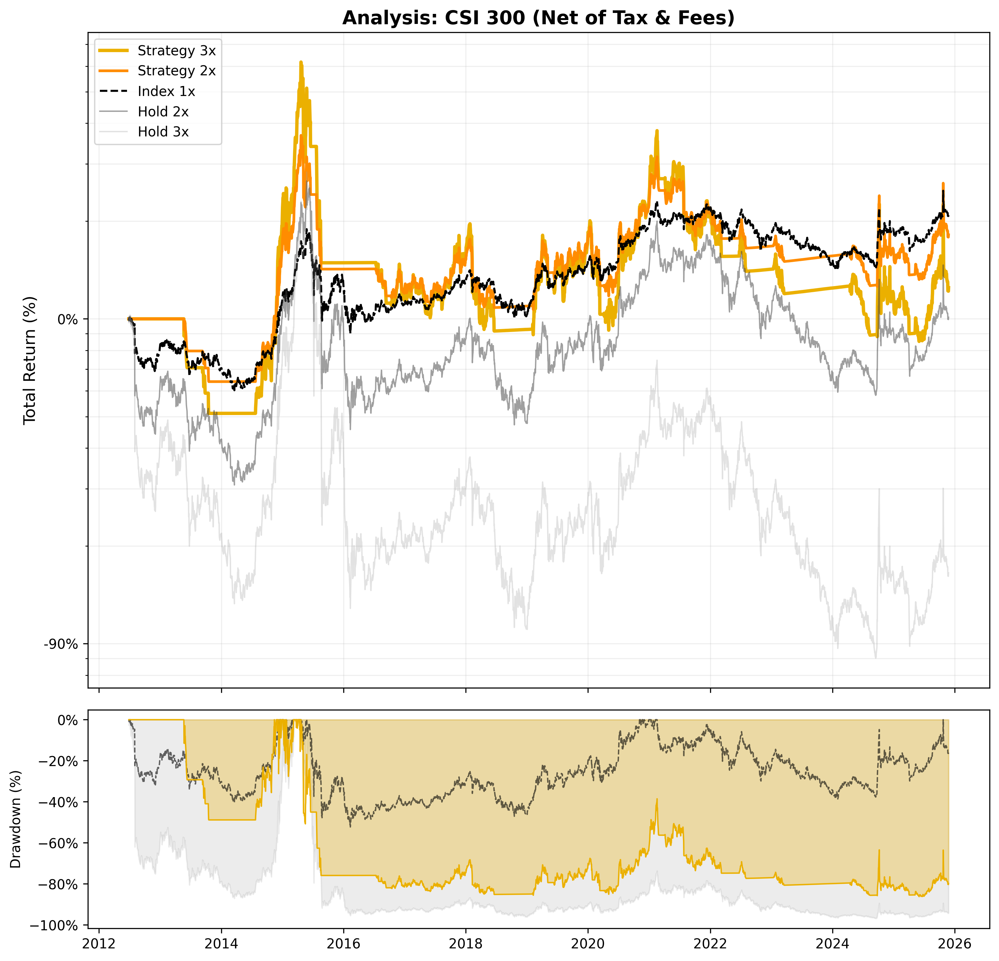

# 📈 Strategy Report: CSI 300

**Date:** 2025-11-25 03:48
**Index:** 000300.SS
**Settings:** Tax 27.500000000000004% | Spread 0.5% | Slip 0.2%

## 1. Performance (Net of Tax)
| Strategy | Best Parameters | Total Return | CAGR | Max Drawdown |
| :--- | :--- | :---: | :---: | :---: |
| Strategy 3x | `SMA 220 / Buf 1.0% / SL 14%` | **-12%** | **-2.61%** | -47.35% 
| Strategy 2x | `SMA 220 / Buf 1.0% / SL 14%` | 0% | 0.10% | -32.64%
| Index 1x | - | -13% | -3.01% | -40.91% 
| Index 2x | - | -47% | -12.51% | -72.03%
| Index 3x | - | -71% | -22.96% | -87.58% 

## 2. Current Status (2025-11-24)
| Strategy | Phase | Profit | Days | Analysis | Action |
| :--- | :---: | :---: | :---: | :--- | :---: |
| Strategy 3x | LONG | +46.58% | 202 | `SAFETY: 8.20%` | **HOLD** |
| Strategy 2x | LONG | +31.27% | 202 | `SAFETY: 8.20%` | **HOLD** |

## 3. Visualization

