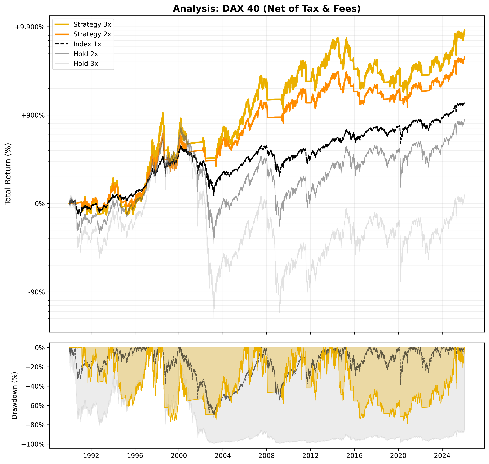

# 📈 Strategy Report: DAX 40

**Date:** 2025-12-19 06:21
**Index:** ^GDAXI
**Settings:** Tax 27.500000000000004% | Spread 0.5% | Slip 0.2%

## 1. Performance (Net of Tax)
| Strategy | Best Parameters | Total Return | CAGR | YTD Return | 3Y Return | 5Y Return | YTD CAGR | 3Y CAGR | 5Y CAGR | Max Drawdown |
| :--- | :--- | :---: | :---: | :---: | :---: | :---: | :---: | :---: | :---: | :---: |
| Strategy 3x | `SMA 180 / Buf 5.0% / SL 18%` | **7,858%** | **12.94%** | 46% | 134% | 255% | 48.73% | 32.15% | 28.36% | -79.03% 
| Strategy 2x | `SMA 180 / Buf 5.0% / SL 18%` | 4,066% | 10.93% | 35% | 96% | 168% | 36.35% | 24.74% | 21.44% | -62.82%
| Index 1x | - | 898% | 6.61% | 15% | 49% | 61% | 15.80% | 14.03% | 9.88% | -72.71% 
| Index 2x | - | 515% | 5.18% | 25% | 88% | 100% | 26.31% | 23.01% | 14.67% | -95.29%
| Index 3x | - | 6% | 0.17% | 34% | 130% | 129% | 35.25% | 31.40% | 17.67% | -99.40% 

## 2. Current Status (2025-12-18)
| Strategy | Phase | Profit | Days | Analysis | Action |
| :--- | :---: | :---: | :---: | :--- | :---: |
| Strategy 3x | LONG | +152.47% | 764 | `SAFETY: 7.17%` | **HOLD** |
| Strategy 2x | LONG | +100.10% | 764 | `SAFETY: 7.17%` | **HOLD** |

## 3. Visualization

