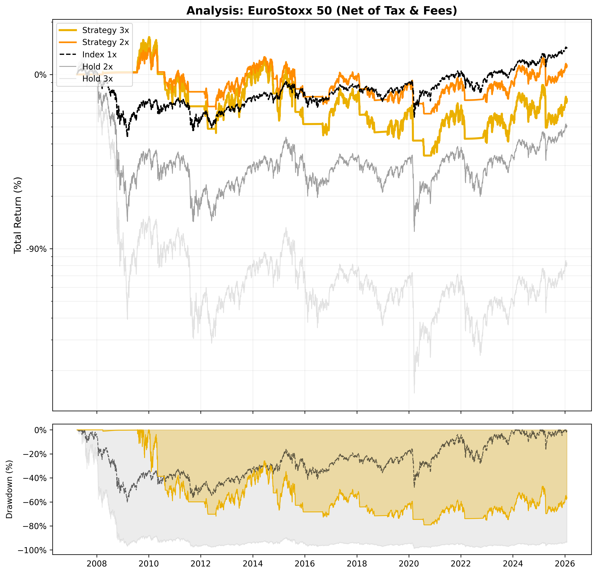

# 📈 Strategy Report: EuroStoxx 50

**Date:** 2025-12-21 06:21
**Index:** ^STOXX50E
**Settings:** Tax 27.500000000000004% | Spread 0.5% | Slip 0.2%

## 1. Performance (Net of Tax)
| Strategy | Best Parameters | Total Return | CAGR | YTD Return | 3Y Return | 5Y Return | YTD CAGR | 3Y CAGR | 5Y CAGR | Max Drawdown |
| :--- | :--- | :---: | :---: | :---: | :---: | :---: | :---: | :---: | :---: | :---: |
| Strategy 3x | `SMA 240 / Buf 5.0% / SL 13%` | **-35%** | **-2.27%** | 8% | 47% | 90% | 7.91% | 13.20% | 13.34% | -79.12% 
| Strategy 2x | `SMA 240 / Buf 5.0% / SL 13%` | 5% | 0.28% | 8% | 44% | 77% | 8.75% | 12.47% | 11.75% | -58.00%
| Index 1x | - | 27% | 1.28% | 13% | 35% | 66% | 13.82% | 10.19% | 10.34% | -60.31% 
| Index 2x | - | -53% | -3.90% | 21% | 52% | 110% | 22.48% | 14.54% | 15.56% | -89.32%
| Index 3x | - | -93% | -12.94% | 28% | 65% | 142% | 29.84% | 17.62% | 18.82% | -98.83% 

## 2. Current Status (2025-12-19)
| Strategy | Phase | Profit | Days | Analysis | Action |
| :--- | :---: | :---: | :---: | :--- | :---: |
| Strategy 3x | LONG | +31.65% | 240 | `SAFETY: 11.15%` | **HOLD** |
| Strategy 2x | LONG | +22.23% | 240 | `SAFETY: 11.15%` | **HOLD** |

## 3. Visualization

