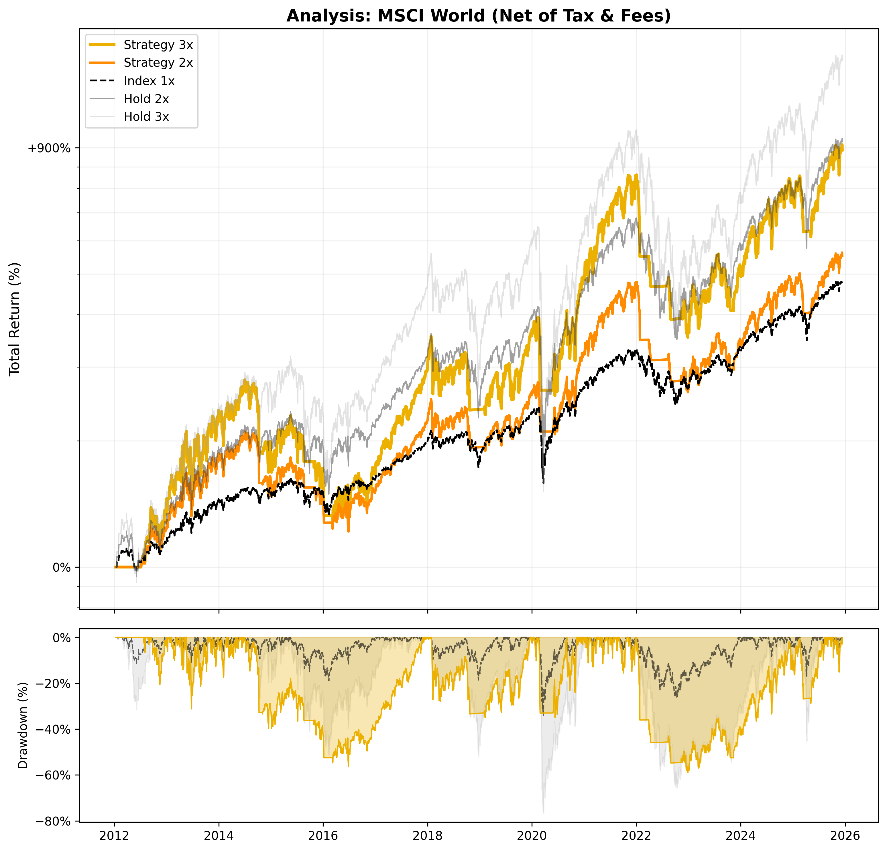

# 📈 Strategy Report: MSCI World

**Date:** 2025-12-09 06:20
**Index:** URTH
**Settings:** Tax 27.500000000000004% | Spread 0.5% | Slip 0.2%

## 1. Performance (Net of Tax)
| Strategy | Best Parameters | Total Return | CAGR | YTD Return | 3Y Return | 5Y Return | YTD CAGR | 3Y CAGR | 5Y CAGR | Max Drawdown |
| :--- | :--- | :---: | :---: | :---: | :---: | :---: | :---: | :---: | :---: | :---: |
| Strategy 3x | `SMA 120 / Buf 4.0% / SL 11%` | **887%** | **17.90%** | 34% | 128% | 116% | 36.74% | 31.50% | 16.54% | -59.01% 
| Strategy 2x | `SMA 120 / Buf 4.0% / SL 11%` | 451% | 13.06% | 22% | 85% | 78% | 23.56% | 22.65% | 12.22% | -45.43%
| Index 1x | - | 274% | 9.94% | 15% | 50% | 60% | 16.19% | 14.28% | 9.78% | -34.01% 
| Index 2x | - | 676% | 15.87% | 25% | 90% | 98% | 27.29% | 23.60% | 14.57% | -59.29%
| Index 3x | - | 1,099% | 19.56% | 34% | 134% | 127% | 37.13% | 32.55% | 17.80% | -76.70% 

## 2. Current Status (2025-12-08)
| Strategy | Phase | Profit | Days | Analysis | Action |
| :--- | :---: | :---: | :---: | :--- | :---: |
| Strategy 3x | LONG | +56.22% | 220 | `SAFETY: 8.29%` | **HOLD** |
| Strategy 2x | LONG | +36.62% | 220 | `SAFETY: 8.29%` | **HOLD** |

## 3. Visualization

