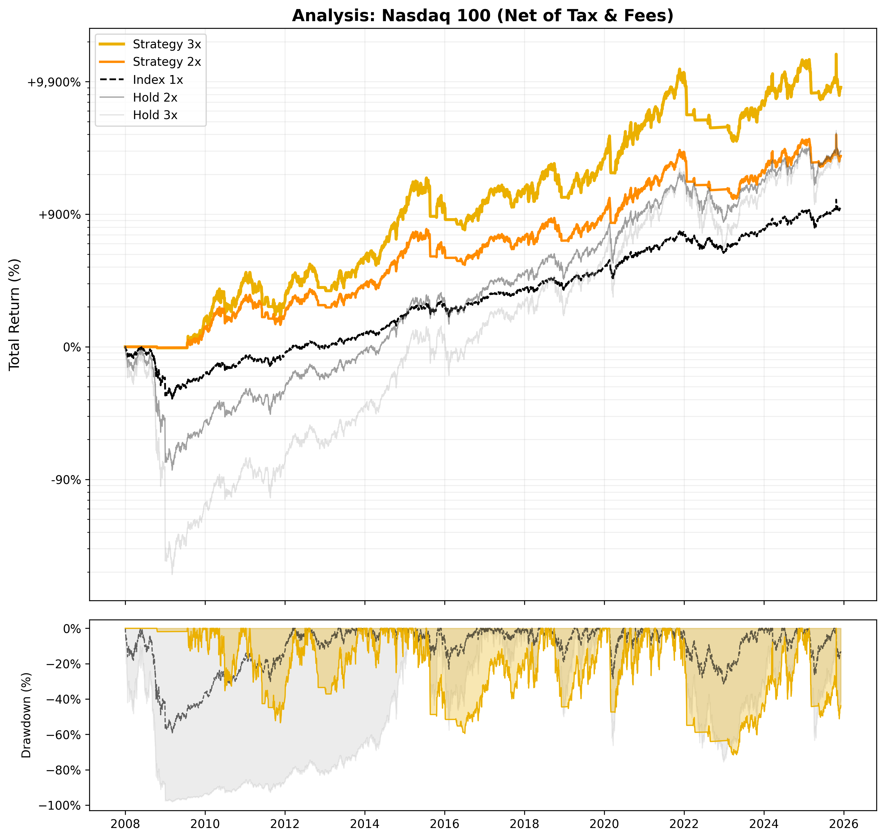

# 📈 Strategy Report: Nasdaq 100

**Date:** 2025-11-25 04:49
**Index:** ^NDX
**Settings:** Tax 27.500000000000004% | Spread 0.5% | Slip 0.2%

## 1. Performance (Net of Tax)
| Strategy | Best Parameters | Total Return | CAGR | Max Drawdown |
| :--- | :--- | :---: | :---: | :---: |
| Strategy 3x | `SMA 220 / Buf 2.0% / SL 16%` | **145,295%** | **22.49%** | -73.49% 
| Strategy 2x | `SMA 220 / Buf 2.0% / SL 16%` | 35,566% | 17.79% | -57.53%
| Index 1x | - | 7,762% | 12.93% | -82.91% 
| Index 2x | - | 16,985% | 15.40% | -98.91%
| Index 3x | - | 3,679% | 10.65% | -99.98% 

## 2. Current Status (2025-11-24)
| Strategy | Phase | Profit | Days | Analysis | Action |
| :--- | :---: | :---: | :---: | :--- | :---: |
| Strategy 3x | LONG | +54.80% | 196 | `SAFETY: 11.79%` | **HOLD** |
| Strategy 2x | LONG | +36.40% | 196 | `SAFETY: 11.79%` | **HOLD** |

## 3. Visualization

