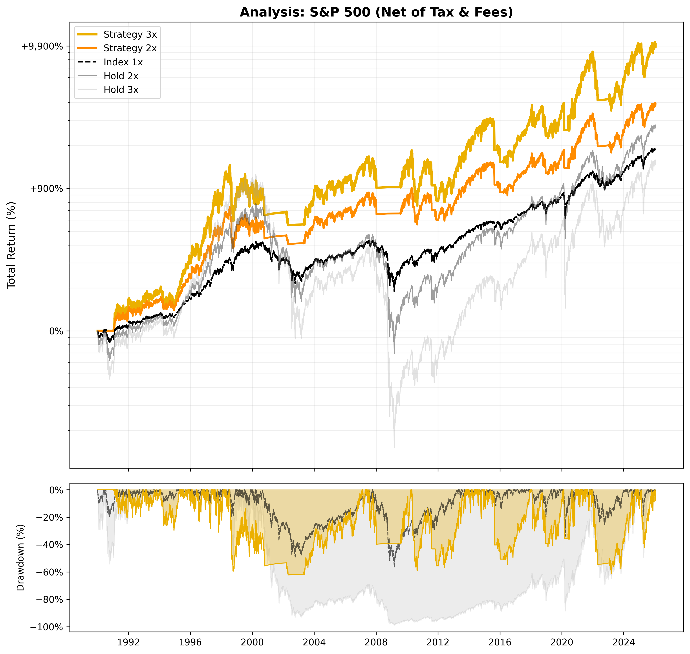

# 📈 Strategy Report: S&P 500

**Date:** 2025-11-27 06:18
**Index:** SPY
**Settings:** Tax 27.500000000000004% | Spread 0.5% | Slip 0.2%

## 1. Performance (Net of Tax)
| Strategy | Best Parameters | Total Return | CAGR | Max Drawdown |
| :--- | :--- | :---: | :---: | :---: |
| Strategy 3x | `SMA 220 / Buf 3.0% / SL 12%` | **8,939%** | **14.71%** | -65.90% 
| Strategy 2x | `SMA 210 / Buf 2.0% / SL 12%` | 2,958% | 10.98% | -46.79%
| Index 1x | - | 1,934% | 9.61% | -55.21% 
| Index 2x | - | 5,297% | 12.92% | -88.14%
| Index 3x | - | 5,589% | 13.10% | -98.13% 

## 2. Current Status (2025-11-26)
| Strategy | Phase | Profit | Days | Analysis | Action |
| :--- | :---: | :---: | :---: | :--- | :---: |
| Strategy 3x | LONG | +49.55% | 198 | `SAFETY: 11.00%` | **HOLD** |
| Strategy 2x | LONG | +32.62% | 198 | `SAFETY: 11.00%` | **HOLD** |

## 3. Visualization

